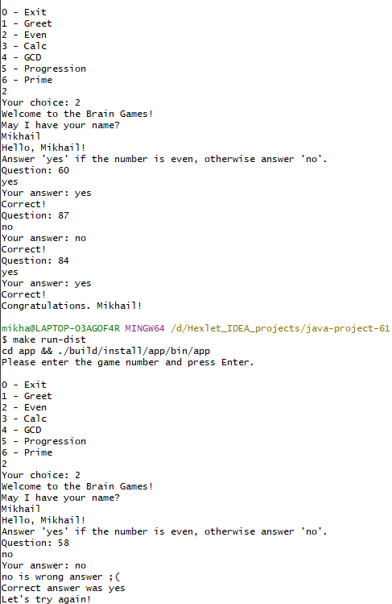
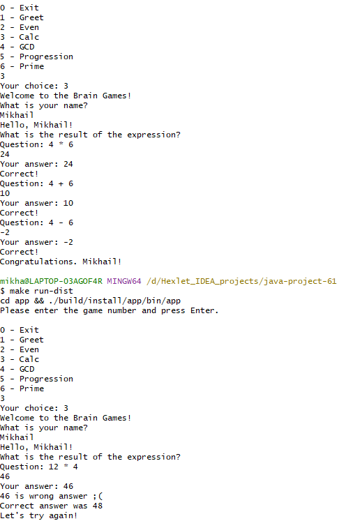
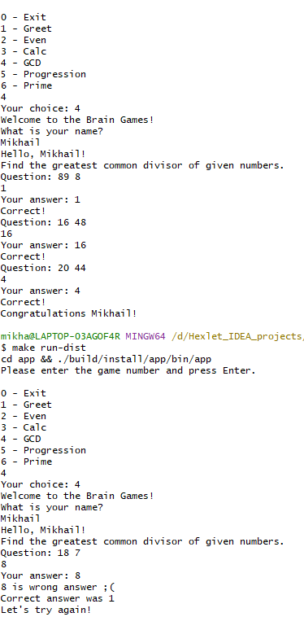
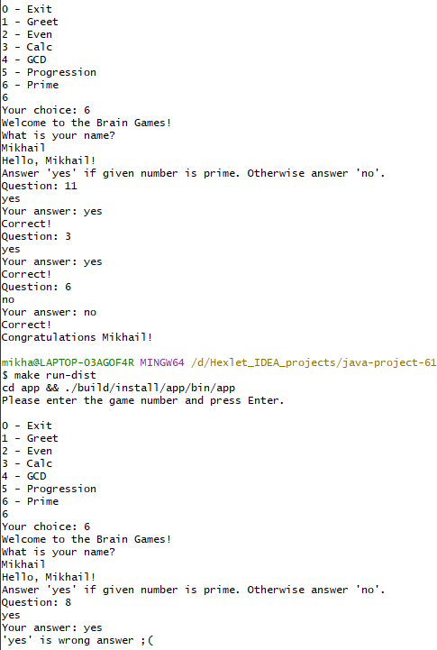

### Project tests

### Maintainability Badge

### Test Coverage Badge

# BRAIN GAMES

  - Even. "Check for parity". The essence of the game is as follows: the user is shown a random number. 
    And the user must answer 'yes' if the number is even, or 'no' if it not.

  - Calculator. The user is shown a random mathematical expression, 
    which must be calculated and the correct answer written down.

  - GCD. The essence of the game is as follows: the user is shown two random numbers. 
    The user must calculate and enter the greatest common divisor of these numbers.

  - Progression. We show the player a series of numbers that form an arithmetic progression, 
    replacing any of the numbers with two dots. The player must determine this number.

  - Prime. Game "Is a number prime?" The user is given a number, 
    and the user must answer 'yes' if the number is even, or 'no' if it not.

# Gameplay 
#### Even game ####

#### Calculator game ####

#### GSD ####

#### Progression ###
Soon comes a picture

#### Prime ###

